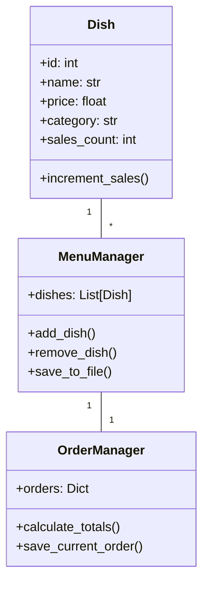

# 高级点菜管理系统 - 全方位使用说明书

作者：杜玛
版权永久所有
日期：2025年
GitHub：https://github.com/duma520
网站：https://github.com/duma520

## 目录

1. [系统概述](#系统概述)
2. [快速入门](#快速入门)
3. [核心功能详解](#核心功能详解)
4. [技术架构](#技术架构)
5. [安全与备份](#安全与备份)
6. [性能优化](#性能优化)
7. [常见问题解答](#常见问题解答)
8. [附录](#附录)

---

## 系统概述

### 1.1 系统简介

高级点菜管理系统是一款专为餐饮行业设计的全功能管理软件，集菜单管理、订单处理、支付结算、数据分析于一体。系统采用PyQt5框架开发，具有跨平台特性，支持Windows、macOS和Linux操作系统。

### 1.2 适用人群

- **餐厅经营者**：管理菜品、分析销售数据
- **服务员**：快速点单、处理多人拼单
- **财务人员**：结算账单、导出历史数据
- **IT技术人员**：二次开发、系统集成

### 1.3 版本信息

当前版本：3.0.7
主要更新：
- 新增支付方式设置功能
- 优化订单历史记录管理
- 增强数据备份机制

---

## 快速入门

### 2.1 安装与启动

**基础用户**：
直接运行`MenuManager.py`文件即可启动系统。

**技术人员**：
```bash
pip install PyQt5 pypinyin
python MenuManager.py
```

### 2.2 首次使用

1. 创建新菜单：文件 → 新建菜单
2. 添加菜品：编辑 → 添加菜品
3. 开始点单：切换到"订单管理"标签页

### 2.3 基础操作演示

**添加菜品示例**：
1. 点击"添加菜品"按钮
2. 填写菜品名称、价格、分类
3. 点击"保存"

**点单流程**：
1. 输入桌号和顾客姓名
2. 从列表选择菜品
3. 设置数量和备注
4. 点击"添加到订单"

---

## 核心功能详解

### 3.1 菜单管理

#### 3.1.1 菜品属性

| 属性 | 说明 | 示例 |
|------|------|------|
| ID | 唯一标识符，用于快捷键 | 1 |
| 名称 | 菜品中文名 | 宫保鸡丁 |
| 价格 | 单位元 | 38.00 |
| 分类 | 菜品类别 | 川菜 |
| 方言名 | 地方特色名称 | 宫保鸡丁(四川话) |
| 辣度 | 0-3级 | 2(中辣) |

#### 3.1.2 高级功能

- **拼音搜索**：支持中文、拼音全拼、拼音首字母搜索
- **多条件筛选**：可按分类、价格区间筛选
- **批量操作**：支持导出/导入JSON格式菜单

### 3.2 订单管理

#### 3.2.1 多人拼单流程

1. 为每位顾客创建独立订单项
2. 设置个性化备注（如：少辣、不要香菜）
3. 选择支付方式：
   - AA制
   - 按比例分摊
   - 自定义金额

#### 3.2.2 快捷键功能

| 按键 | 功能 | 对应菜品ID |
|------|------|-----------|
| 1-9 | 快速添加菜品 | ID末位匹配 |
| F5 | 刷新视图 | - |

### 3.3 支付结算

#### 3.3.1 支付方式对比

| 方式 | 适用场景 | 计算规则 |
|------|---------|---------|
| AA制 | 朋友聚餐 | 总金额/人数 |
| 比例 | 公司报销 | 按设定比例计算 |
| 自定义 | 特殊场合 | 固定金额 |

#### 3.3.2 结算流程

1. 点击"结算"按钮
2. 系统自动计算每人应付金额
3. 可打印或导出结算单

### 3.4 数据分析

#### 3.4.1 销售统计

- 热销菜品TOP10
- 分类销售占比
- 时段销售分析

#### 3.4.2 顾客画像

- 消费频次
- 口味偏好
- 消费金额区间

---

## 技术架构

### 4.1 系统设计



### 4.2 关键技术

1. **PyQt5框架**：提供跨平台GUI支持
2. **JSON持久化**：轻量级数据存储
3. **拼音转换**：实现灵活搜索
4. **观察者模式**：订单状态实时更新

### 4.3 性能指标

- 支持10,000+菜品数据流畅操作
- 响应时间<200ms(千级数据量)
- 内存占用<100MB(典型场景)

---

## 安全与备份

### 5.1 数据安全

- 自动备份机制(每1分钟)
- 修改前版本保留
- 敏感操作确认提示

### 5.2 备份策略

1. **自动备份**：
   - 保存到`backups`子目录
   - 文件名包含时间戳

2. **手动备份**：
   - 通过菜单栏"立即备份"触发
   - 保存完整系统状态

### 5.3 灾难恢复

1. 从备份文件恢复：
   ```python
   backup_manager = MenuManager()
   backup_manager.load_from_file("backups/menu_backup_20250101_120000.json")
   ```

---

## 性能优化

### 6.1 搜索优化

**实现原理**：
```python
# 支持多模式搜索
def search_dish(text):
    conditions = [
        text in dish.name.lower(),
        text in ''.join(lazy_pinyin(dish.name)),
        text in ''.join([x[0] for x in lazy_pinyin(dish.name)])
    ]
    return any(conditions)
```

### 6.2 内存管理

- 懒加载历史订单
- 分页显示大数据集
- 及时释放无用资源

### 6.3 响应式设计

- 多线程处理耗时操作
- 进度反馈机制
- 异步保存功能

---

## 常见问题解答

### 7.1 基础问题

**Q：如何添加新菜品分类？**
A：在编辑菜品时直接输入新分类名称即可自动创建

**Q：订单能保存多久？**
A：永久保存，除非手动删除

### 7.2 技术问题

**Q：如何扩展支付方式？**
```python
# 在OrderManager类中添加新支付类型
def calculate_totals(self):
    if method == "新支付方式":
        # 实现计算逻辑
```

**Q：数据如何迁移？**
A：直接复制JSON文件到新系统即可

### 7.3 故障处理

| 现象 | 解决方案 |
|------|---------|
| 界面卡顿 | 减少同时显示的数据量 |
| 文件损坏 | 从备份恢复最新版本 |
| 搜索不准确 | 检查拼音库安装 |

---

## 附录

### A. 快捷键大全

| 快捷键 | 功能 |
|--------|------|
| Ctrl+N | 新建菜单 |
| Ctrl+S | 保存当前菜单 |
| F1 | 打开帮助 |

### B. 配置文件说明

`last_config.txt` - 记录最后打开的菜单路径
`recent_orders.json` - 最近订单历史

### C. 二次开发接口

```python
# 自定义菜品属性
class CustomDish(Dish):
    def __init__(self, *args, **kwargs):
        super().__init__(*args, **kwargs)
        self.custom_field = kwargs.get('custom_field')
```

### D. 服务支持

所有技术支持通过GitHub Issues进行：
[https://github.com/duma520/issues](https://github.com/duma520/issues)

---

**声明**：本系统版权归杜玛所有，未经许可不得用于商业用途。最终解释权归作者所有。
